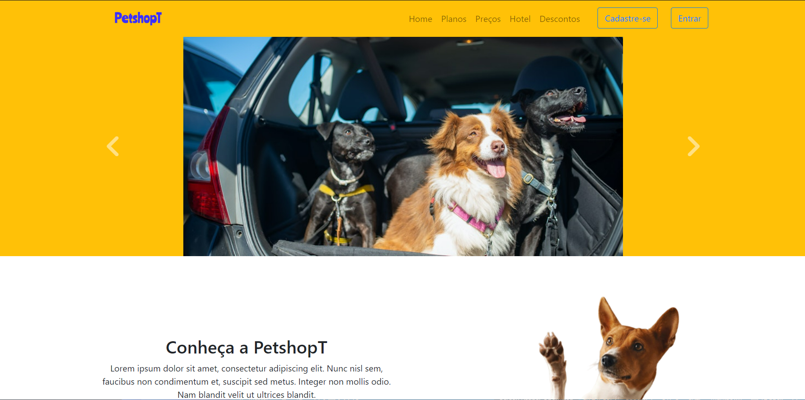

####Projeto Petshopt####

PetshopT é um projeto pessoal baseado e inpirado em um dos projetos disponibilizados pela Udemy que seria o projeto Finans onde a tecnologia utilizada é o
bootstrap um framework de front-end composto de HTML, CSS e Javascript, onde conseguimos com classes em CSS desenvolver sites muito interessantes e profissionais, 
alem disso conseguimos aplicar, de maneira muito facil desings responsivos que o ponto principal que queremos exemplificar nesse projeto. Desing responsivo consegue 
se adaptar a diversos tipos de telas e dipositivos.

Exemplos do projeto:

<<<<<<< HEAD

=======

Barra de Navegação e Carousel.

Conteudo.

Rodapé.

Resposividade:

Menu hamburguer.

Imagigens sumindo para melhor vizualização.

Em seu menor tamanho.

>>>>>>> a696544483ce21e85741852c21ba2441a3706f5d
Fontes das Imagens Utilizadas:  
<a href="https://br.freepik.com/fotos-gratis/adoravel-cachorro-basenji-marrom-e-branco-sorrindo-e-dando-mais-uns-cinco-isolado-no-branco_11829591.htm#query=animal&position=1&from_view=search&track=sph">Imagem de bublikhaus</a> no Freepik

Foto de Arina Krasnikova: https://www.pexels.com/pt-br/foto/tapete-carpete-gatos-fofo-7725966/

Foto de Kampus Production: https://www.pexels.com/pt-br/foto/fotografia-animal-fotografia-de-animais-animais-bichos-8734473/

Foto de Alena Darmel: https://www.pexels.com/pt-br/foto/ola-oi-alo-animais-9040613/

Foto de Arina Krasnikova: https://www.pexels.com/pt-br/foto/animais-bichos-tapete-carpete-7726102/

<a href="https://br.freepik.com/fotos-gratis/foto-isolada-de-gato-ruivo-olhando-para-cachorro-retriever-olhando-para-a-camera-na-superficie-branca_17234217.htm#query=animal&position=34&from_view=search&track=sph">Imagem de wirestock</a> no Freepik

<a href="https://br.freepik.com/fotos-gratis/retrato-de-grupo-de-filhotes-adoraveis_3532149.htm#query=animal&position=0&from_view=search&track=sph">Imagem de rawpixel.com</a> no Freepik

Foto de cottonbro studio: https://www.pexels.com/pt-br/foto/animal-bicho-tigela-bowl-6568944/

Foto de Karin Chantanaprayura: https://www.pexels.com/pt-br/foto/animal-bicho-tomando-banho-banho-7224651/

Foto de Blue Bird: https://www.pexels.com/pt-br/foto/adoravel-encantador-cativante-adulto-7210360/

